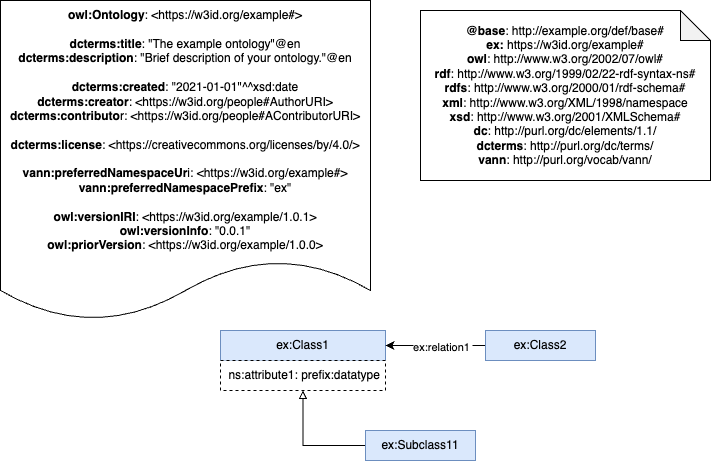

# XXX Ontology

The XXX ontology describes the domain of XXX

# Purpose and scope of the vocabulary

The purpose of the XXX ontology is to YYYY. 
The scope of the XXX ontology is limited to ZZZ.

# Ontology prefix and namespace

The XXX ontology prefix is: XXX and it is published under the namespace: https://webdomain.ext/def/domain/subdomain# 

# Ontology Conceptualization Image

Every ontology development repository should include, in this root README, a visual representation of the ontology conceptualization.
This image helps users and contributors quickly understand the ontology’s structure, key concepts, and relationships.
- The image should be located in the conceptualization folder.
- Accepted formats: .svg, .png, or .drawio.
- It should be referenced in this README using Markdown syntax, for example:

# Reposity structure

The repository should contain (at least) the following folders:

| Folder | Description |
|--------|--------------|
| **diagrams/** | Stores diagrams and other resources representing the conceptual model of the ontology (e.g., class hierarchies, relationships). |
| **documentation/** | Stores the HTML or human oriented documentation of the ontology and related artefacts. |
| **examples/** | Includes examples that demonstrate how to instantiate or apply the ontology in real data scenarios. |
| **kos/** | Stores controlled vocabularies or KOS implementation, usually SKOS implementations in rdf. |
| **ontology/** | Contains the actual ontology implementation files in formats such as `.owl`, `.rdf`, `.ttl`, or `.jsonld`. |
| **requirements/** | Contains all documents used to define the ontology’s requirements: data example, competency questions, functional requirements, use cases, etc. |
| **shapes/** | Contains the SHACL shapes used to define and validate ontology constraints. |

# Project maintenance

To manage those incidents or suggested improvements with respect to the vocabulary, we recommend you to follow
the guides provided in [Issues Management](https://github.com/nombre-repositorio/wiki/issues-management) to
generate an issue (work in progress)

# Funding

Add here project funding and needed images.
